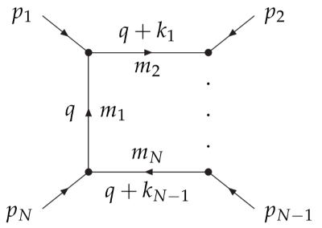
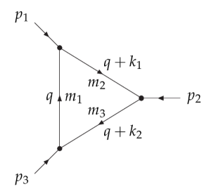

# Definitions

Copied from the [`LoopTools` manual](https://github.com/fkguo/LoopTools.jl/blob/master/docs/LT215Guide.pdf).

## General one-loop integral

Consider a general one-loop integral shown as follows:



The tensor loop integral is defined as 

```math
T_{\mu_1\mu_2...\mu_P}^N =  \frac{\mu^{4-D}}{i\pi^{D/2} r_\Gamma} \int d^D q
\frac{ q_{\mu_1}q_{\mu_2}...q_{\mu_P} }{(q^2-m_1^2)\left[(q+k_1)^2-m_2^2\right] \cdots
\left[(q+k_{N-1})^2-m_N^2\right]}
```

with ``r_\Gamma = \frac{\Gamma^2(1-\varepsilon) \Gamma(1+\varepsilon)}{\GammaΓ(1-2\varepsilon)}``, ``D=4-2\varepsilon``.

The momentum flow is shown in the figure. We have
```math
\begin{aligned}
& p_1 = k_1, \quad p_2 = k_2 - k_1, \quad \ldots, \quad p_N = k_N - k_{N-1}, \\
& k_1 = p_1, \quad k_2 = p_1 + p_2, \quad \ldots, \quad k_N = \sum_{i = 1}^N p_i .
\end{aligned}
```

## Tensor coefficients

The 1-point, 2-point, 3-point, 4-point and 5-point scalar loop integrals are denoted by `A0`, `B0`, `C0`, `D0` and `E0`, respectively.

The 1-loop tensor integral can be decomposed as
```math
\begin{aligned}
B_\mu & = k_{1\mu} B_1, \\
B_{\mu\nu} & = g_{\mu\nu} B_{00} + k_{1\mu} k_{1\nu} B_{11}, \\
C_\mu &= k_{1\mu} C_1 + k_{2\mu} C_2 \\
C_{\mu\nu} &= g_{\mu\nu} C_{00} + \sum_{i,j=1}^2 k_{i\mu}k_{j\nu} C_{ij}, \\
C_{\mu\nu\rho} &= \sum_{i=1}^2 \left(g_{\mu\nu}k_{i\rho} + g_{\nu\rho} k_{i\mu} + g_{\mu\rho} k_{i\nu} \right) C_{00i} + \sum_{i,j,\ell=1}^2 k_{i\mu}k_{j\nu}k_{\ell \rho} C_{ij\ell}, \\
D_\mu &= \sum_{i=1}^3 k_{i\mu} D_i ,\\
D_{\mu\nu} &= g_{\mu\nu} D_{00} + \sum_{i,j=1}^3 k_{i\mu}k_{j\nu} D_{ij}, \\
D_{\mu\nu\rho} &= \sum_{i=1}^3 \left(g_{\mu\nu}k_{i\rho} + g_{\nu\rho} k_{i\mu} + g_{\mu\rho} k_{i\nu} \right) D_{00i} + \sum_{i,j,\ell=1}^3 k_{i\mu}k_{j\nu}k_{\ell \rho} D_{ij\ell}, \\
D_{\mu\nu\rho\sigma} &= \left( g_{\mu\nu}g_{\rho\sigma} + g_{\mu\rho}g_{\nu\sigma} + g_{\mu\sigma}g_{\nu\rho} \right) D_{0000} + \sum_{i,j,\ell,m=1}^3 k_{i\mu}k_{j\nu}k_{\ell \rho}k_{m\sigma} D_{ij\ell m} \\
&\phantom{=} + \sum_{i,j=1}^3 \left(g_{\mu\nu}k_{i\rho}k_{j\sigma} + g_{\nu\rho} k_{i\mu}k_{j\sigma} + g_{\mu\rho} k_{i\nu}k_{j\sigma} 
+ g_{\mu\sigma}k_{i\nu}k_{j\rho} + g_{\nu\sigma}k_{i\mu}k_{j\rho} + g_{\rho\sigma}k_{i\mu}k_{j\nu} \right) D_{00ij} . \\
\end{aligned}
```

## Conventions for the momenta

Consider the triangle diagram:



The 3-point loop function can be written either in terms of the external momenta as
```math
C\left(p_1^2, p_2^2, (p_1+p_2)^2, m_1^2, m_2^2, m_3^2 \right),
```
or in terms of the momenta $k_i$ as
```math
C\left(k_1^2, (k_1-k_2)^2, k_2^2, m_1^2, m_2^2, m_3^2 \right).
```
The coefficients computed are the coefficients of the momenta $k_i$, e.g., $C_1$ and $C_{112}$ are the coefficients of $k_{1\mu}$ and $k_{1\mu}k_{1\nu}k_{2\rho}$, respectively. The advantage of this basis is that the tensor-coefficient functions are totally symmetric in the indices.

## UV, IR and collinear divergences

### UV divergence

Using dimensional regularization, the UV divergence has the form ``1/\varepsilon -\gamma_E+\log(4\pi)``.
In `LoopTools`, the UV divergence is kept as the ``1/\varepsilon`` part, and the finite part of this 
combination is set as ``\Delta``, which is $0$ (default value in `LoopTools`) in the ``\overline{\rm MS}`` scheme.
Setting ``\Delta=-2`` reproduces the one-loop functions of constrained differential renormalization 
in [Nucl.Phys.B 537 (1999) 561](https://inspirehep.net/literature/472202).
A change of ``\Delta`` can be obsorbed by a change of the dim. reg. scale ``\mu``: 
``\mu_{\rm new}^2 = e^\Delta\mu_{\rm old}^2``. 

Relevant functions: [`getdelta/setdelta`](@ref getdelta).


### IR divergence

The treatment of the IR divergence is controlled by the parameter ``\lambda^2``. 
- ``\lambda^2>0``: photon-mass regularization.
- In dim. reg., ``\lambda^2=0`` gives the finite piece of the result, 
  and ``\lambda^2=-1`` and ``\lambda^2=-2`` return the coefficients of ``1/\varepsilon``
  and ``1/\varepsilon^2``, respectively.

Relevant functions: [`getlambda/setlambda`](@ref getlambda).

For ``\lambda^2\leq0``, the ``\varepsilon^{-1}`` component contains both the UV and IR divergences.
The UV part can be switched off and on by `setuvdiv(1)` and `setuvdiv(0)`, respectively.

Relevant functions: [`getuvdiv/setuvdiv`](@ref getuvdiv).


### Collinear divergence

For the collinear divergence, there is a parameter ``m_{\rm min}^2``; 
all arguments smaller than that are set to 0 to detect the existence of collinear divergence.
If there is a IR divergence, then ``m_{\rm min}^2`` is substituted back to ``p_i^2``.

Relevant functions: [`getminmass/setminmass`](@ref getminmass).


