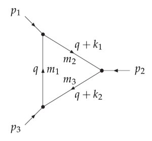

# Examples



Let us compute the 3-point loop integral:
```math
C\left(p_1^2, p_2^2, (p_1+p_2)^2, m_1^2, m_2^2, m_3^2 \right)
```
with some hadron masses as input.

Tensor-coefficients:
```@example 1
using LoopTools
using PrettyPrinting, BenchmarkTools

(@btime Cget(1.87^2, 2.9^2, 5.28^2, 4.36^2, 2.01^2, 0.89^2) ) |> pprint
```
Here we used `Cget` (upper case for the first letter) which returns only the finite piece. If `val_only=true` (default to `false`), then numerical values are given as an `NTuple`. If we want also the coefficients of ``1/\varepsilon`` and ``\varepsilon^{-2}``, we need `cget` (lower case) or `cgetsym`, see below.

Scalar integral:
```@example 1
# or simply using `C0`
C0i(cc0, 1.87^2, 2.9^2, 5.28^2, 4.36^2, 2.01^2, 0.89^2)
```

Preallocate a vector to receive results from `bput!`:
```@example 1
const res = Vector{ComplexF64}(undef, 33)
@btime bput!(res, 1, 0.1, 0.1)
pprint(res)
```

The same result can be obtained using `bget(1, 0.1, 0.1)`, which takes 
only the `p^2, m1^2, m2^2` as the arguments, and the preallocated array has already been defined 
inside the package as `LoopTools._Bres_` (`LoopTools._Cres_` for the three-point loop and so on).


Writing out the ``\varepsilon^{-1}`` (corresponding to `DR1eps` in the `Mathematica` version) terms explicitly:
```@example 1
bgetsym(1, 0.1, 0.1) |> pprint
```


```@example 1
Bget(1, 0.1, 0.1, val_only = true)
```

Real and imaginary parts of a three-point scalar integral showing 
the effect of the Landau singularity:
```@example 1
using Plots; default(frame=:box, minorticks=4)

c0(x) = -C0(1.87^2, x^2, 5.28^2, (4.36-0.05im)^2, 2.01^2, 0.89^2 )

plot(2.5:0.001:3.4, x-> real(c0(x)), label="Re" )
plot!(2.5:0.001:3.4, x-> imag(c0(x)), label="Im" )
```